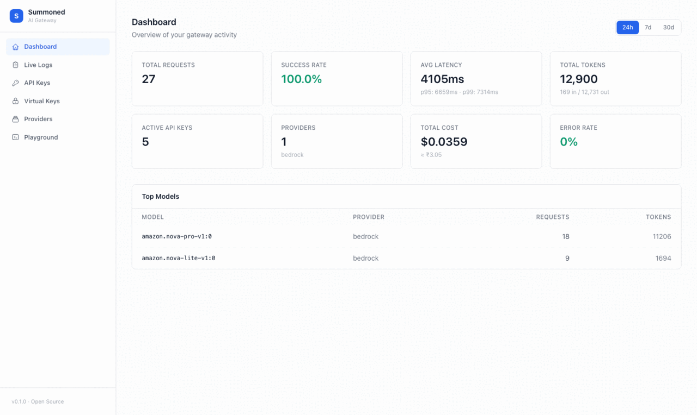

<h1 align="center">Summoned AI Gateway</h1>
<h4 align="center">The open-source AI gateway built for India — and the world.</h4>
<h4 align="center">Route to 17 LLM providers with 1 fast & friendly API.</h4>

<p align="center">
  <a href="#quickstart-2-mins">Quickstart</a> &middot;
  <a href="#supported-providers">Providers</a> &middot;
  <a href="#core-features">Features</a> &middot;
  <a href="#console">Console</a> &middot;
  <a href="./CONTRIBUTING.md">Contributing</a>
</p>

<p align="center">
  <a href="./LICENSE"></a>
  <a href="https://github.com/summoned-tech/summoned-ai-gateway/stargazers"></a>
  
  
  
  
</p>

---

A **lightweight, open-source AI gateway** that sits between your app and every LLM provider. Bring your own provider API keys — Summoned adds intelligent routing, automatic failover, response caching, cost governance, guardrails, and a full self-hosted console on top.

**No code changes in your app.** Drop-in replacement for the OpenAI API.

**Zero infra to start.** Just set `ADMIN_API_KEY` + one provider key and run.

- [x] **Zero infra required** — runs completely stateless. Add Redis for caching. Add Postgres for history.
- [x] **India-native** — Sarvam AI, Yotta Labs, AWS Bedrock `ap-south-1` (DPDP-compliant defaults), INR cost tracking.
- [x] **Full console, self-hosted, free** — dashboard, live logs, playground, cost analytics. No cloud subscription needed.
- [x] **Guardrails in the free tier** — PII blocking, content filters, regex rules. Competitors lock this behind enterprise.
- [x] **17 providers. Any model.** — bring any OpenAI-compatible endpoint via `CUSTOM_PROVIDERS`.
- [x] **Daily token budgets** — hard caps per API key. Critical for agents. Free.

#### What can you do?

- [x] Route to 17 providers through one endpoint — [Supported Providers](#supported-providers)
- [x] Zero downtime when a provider goes down — [Automatic Failover & Circuit Breakers](#reliability)
- [x] Route to the cheapest or fastest model automatically — [Intelligent Routing](#intelligent-routing)
- [x] Stop runaway agent loops before they drain your budget — [Daily Token Budgets](#cost-governance)
- [x] Cache repeated queries — [Response Caching](#performance)
- [x] Block PII, profanity, injection attempts — [Guardrails](#security)
- [x] See cost (USD + INR), latency, and token usage in real time — [Observability](#observability)
- [x] Encrypt and store provider keys on the gateway — [Virtual Keys](#security)
- [x] Works with OpenAI SDK, LangChain, LlamaIndex, CrewAI, Vercel AI SDK — [Framework Support](#works-with-any-framework)
- [x] Add any OpenAI-compatible provider in 5 lines — [Custom Providers](#adding-a-provider)

> [!TIP]
> Starring this repo helps more developers discover the gateway 🙏
>
> ⭐ **Star us on GitHub** — it takes 2 seconds and means a lot.

---

## Console



The gateway ships with a **built-in web console** at `/console` — no separate app, no extra services.

| Page | What you get |
|---|---|
| **Dashboard** | Requests, success rate, latency percentiles (p50/p95/p99), token volume, cost in USD + INR |
| **Live Logs** | Real-time WebSocket stream of every request — filter by status or provider, click to expand |
| **API Keys** | Create, list, and revoke `sk-smnd-...` keys from the browser |
| **Virtual Keys** | Store provider credentials encrypted (AES-256-GCM) — callers use a `vk_...` ID |
| **Providers** | Health status, circuit breaker state, avg latency per provider |
| **Playground** | Send test completions to any model — see cost, latency, and cache status live |

---

## Quickstart (2 mins)

### 1. Run the gateway

**Zero-infra — the fastest way to try it (no Postgres, no Redis):**

```bash
docker run -p 4200:4000 \
  -e ADMIN_API_KEY=$(openssl rand -hex 32) \
  -e OPENAI_API_KEY=sk-... \
  ghcr.io/summoned-tech/summoned-ai-gateway:latest
```

> Gateway → `http://localhost:4200` · Console → `http://localhost:4200/console`

**Full setup with Postgres + Redis (persistent logs, managed keys, full console analytics):**

```bash
git clone https://github.com/summoned-tech/summoned-ai-gateway.git
cd summoned-ai-gateway

cp .env.example .env
# Edit .env — set ADMIN_API_KEY + POSTGRES_URL + REDIS_URL + provider keys

docker compose up -d
```

Or with Make (local dev):
```bash
make setup   # deps + Postgres + Redis + migrations + console build
make dev     # gateway with hot reload
```

**What works without Postgres / Redis:**

| Feature | No Postgres | No Redis | Both absent |
|---|---|---|---|
| Chat completions | ✅ | ✅ | ✅ |
| Streaming | ✅ | ✅ | ✅ |
| Guardrails | ✅ | ✅ | ✅ |
| Fallback / circuit breaker | ✅ | ✅ | ✅ |
| Response caching | ✅ | in-memory | in-memory |
| Rate limiting | ✅ | in-memory | in-memory |
| Managed API keys | ❌ | ✅ | ❌ |
| Request history / analytics console | ❌ | ✅ | ❌ |
| Virtual key encryption | ❌ | ✅ | ❌ |

### 2. Make your first request

> **Option A — pass your provider key directly (no gateway key needed):**

```bash
curl http://localhost:4200/v1/chat/completions \
  -H "x-provider-key: sk-YOUR_OPENAI_KEY" \
  -H "Content-Type: application/json" \
  -d '{"model": "openai/gpt-4o-mini", "messages": [{"role":"user","content":"Hello!"}]}'
```

> **Option B — use a gateway-managed key (recommended for teams):**

```bash
# Create a key
curl -X POST http://localhost:4200/v1/keys \
  -H "x-admin-key: YOUR_ADMIN_KEY" \
  -H "Content-Type: application/json" \
  -d '{"name": "my-app", "tenantId": "team-a"}'

# Use it
curl http://localhost:4200/v1/chat/completions \
  -H "Authorization: Bearer sk-smnd-YOUR_KEY" \
  -H "Content-Type: application/json" \
  -d '{"model": "openai/gpt-4o-mini", "messages": [{"role":"user","content":"Hello!"}]}'
```

### 3. Add gateway features

Control retries, fallbacks, caching, routing, and guardrails **per request** via the `x-summoned-config` header:

```python
import json, base64
from openai import OpenAI

client = OpenAI(
    base_url="http://localhost:4200/v1",
    api_key="sk-smnd-...",
)

config = {
    "retry":    { "attempts": 3, "backoff": "exponential" },
    "fallback": ["anthropic/claude-haiku-4", "groq/llama-3.3-70b-versatile"],
    "cache":    True,
    "routing":  "cost",   # cheapest provider first
    "guardrails": {
        "input": [{ "type": "pii", "deny": True }]
    }
}

response = client.chat.completions.create(
    model="openai/gpt-4o",
    messages=[{"role": "user", "content": "Summarize this contract"}],
    extra_headers={
        "x-summoned-config": base64.b64encode(json.dumps(config).encode()).decode()
    }
)
```

Works with any OpenAI-compatible library — **LangChain, LlamaIndex, CrewAI, Autogen, Vercel AI SDK** and more.

---

## Supported Providers

| Provider | Model format | Example | Requires |
|---|---|---|---|
| **OpenAI** | `openai/<model>` | `openai/gpt-4o` | `OPENAI_API_KEY` |
| **Anthropic** | `anthropic/<model>` | `anthropic/claude-sonnet-4-20250514` | `ANTHROPIC_API_KEY` |
| **Google Gemini** | `google/<model>` | `google/gemini-2.0-flash` | `GOOGLE_API_KEY` |
| **Groq** | `groq/<model>` | `groq/llama-3.3-70b-versatile` | `GROQ_API_KEY` |
| **AWS Bedrock** | `bedrock/<model>` | `bedrock/amazon.nova-pro-v1:0` | AWS credentials |
| **Azure OpenAI** | `azure/<deployment>` | `azure/gpt-4o` | `AZURE_OPENAI_API_KEY` + endpoint |
| **Mistral AI** | `mistral/<model>` | `mistral/mistral-large-latest` | `MISTRAL_API_KEY` |
| **Together AI** | `together/<model>` | `together/meta-llama/Llama-3.3-70B-Instruct-Turbo` | `TOGETHER_API_KEY` |
| **DeepSeek** | `deepseek/<model>` | `deepseek/deepseek-chat` | `DEEPSEEK_API_KEY` |
| **Fireworks AI** | `fireworks/<model>` | `fireworks/accounts/fireworks/models/llama-v3p1-70b-instruct` | `FIREWORKS_API_KEY` |
| **Cohere** | `cohere/<model>` | `cohere/command-r-plus` | `COHERE_API_KEY` |
| **Cerebras** | `cerebras/<model>` | `cerebras/llama3.1-70b` | `CEREBRAS_API_KEY` |
| **Perplexity** | `perplexity/<model>` | `perplexity/llama-3.1-sonar-large-128k-online` | `PERPLEXITY_API_KEY` |
| **xAI (Grok)** | `xai/<model>` | `xai/grok-3` | `XAI_API_KEY` |
| **Ollama** | `ollama/<model>` | `ollama/llama3.2` | `OLLAMA_BASE_URL` (local, no key) |
| **Sarvam AI** 🇮🇳 | `sarvam/<model>` | `sarvam/sarvam-2b-v0.5` | `SARVAM_API_KEY` |
| **Yotta Labs** 🇮🇳 | `yotta/<model>` | `yotta/yotta-mini` | `YOTTA_API_KEY` |

> **Pure proxy** — no static model catalog. Any model the upstream provider accepts works immediately, zero config changes when new models launch.
>
> **Any OpenAI-compatible provider** — use `CUSTOM_PROVIDERS` to add Fireworks, Together, or any private endpoint in JSON config. No code changes needed.

---

## Works with any framework

```python
# LangChain
from langchain_openai import ChatOpenAI
llm = ChatOpenAI(base_url="http://localhost:4200/v1", api_key="sk-smnd-...")

# LlamaIndex
from llama_index.llms.openai import OpenAI
llm = OpenAI(base_url="http://localhost:4200/v1", api_key="sk-smnd-...")

# Vercel AI SDK
import { createOpenAI } from "@ai-sdk/openai"
const openai = createOpenAI({ baseURL: "http://localhost:4200/v1", apiKey: "sk-smnd-..." })

# CrewAI, Autogen — just set OPENAI_BASE_URL=http://localhost:4200/v1
```

---

## Core Features

### Reliability

| Feature | How it works |
|---|---|
| **Automatic retries** | Exponential or linear backoff. Configurable attempts per request. |
| **Fallback models** | Specify alternate `provider/model` slugs. Gateway tries them in order on failure. |
| **Circuit breaker** | Per-provider. Opens after 5 failures, retries after 30s (HALF_OPEN state). |
| **Request timeouts** | Per-request timeout with automatic cancellation. |

### Intelligent Routing

| Strategy | How it works |
|---|---|
| `"routing": "cost"` | Sorts model chain by input token price — cheapest first. |
| `"routing": "latency"` | Sorts by observed Exponential Moving Average latency per provider (stored in Redis). |
| `"routing": "default"` | Uses the order you specified in `fallback_models`. |

### Cost Governance

| Feature | How it works |
|---|---|
| **Daily token budget (TPD)** | Hard cap on `inputTokens + outputTokens` per API key per day. Enforced atomically in Redis. Returns `429 BUDGET_EXCEEDED` when exceeded. Auto-resets at midnight. |
| **Per-key rate limiting** | Requests per minute (RPM) sliding window per `sk-smnd-...` key. IP-based for BYOK callers. |
| **Cost tracking** | Per-request cost in USD and INR. In response headers, live logs, and dashboard. |

### Security

| Feature | How it works |
|---|---|
| **API key auth** | SHA-256 hashed `sk-smnd-...` keys. Redis-cached for fast lookups. |
| **Virtual key encryption** | Provider credentials stored with AES-256-GCM via HKDF. Callers reference `vk_...` ID. |
| **Guardrails** | Block PII (email, phone, SSN, Aadhaar, credit card), blocked words, regex, length — on input and output. |
| **Timing-safe auth** | Admin key comparison is constant-time. Timing attack resistant. |
| **Body size limit** | Requests over 4 MB rejected with `413`. |
| **Security headers** | `X-Content-Type-Options`, `X-Frame-Options`, `Referrer-Policy`, HSTS (in production). |
| **Admin brute-force protection** | 20 req/min per IP on admin endpoints. |
| **BYOK mode** | Pass provider key via `x-provider-key` header. No gateway key required. IP-rate-limited. |

### Performance

| Feature | How it works |
|---|---|
| **Response caching** | Redis-backed. Cache key = SHA-256 of (model + messages + params). Identical requests served instantly. |
| **Full streaming** | SSE streaming on all 9 providers. |

### Observability

| Feature | How it works |
|---|---|
| **Live log stream** | WebSocket stream. Every request logged with provider, model, latency, cost, status. |
| **Prometheus metrics** | `/metrics` endpoint (admin-protected). Scrape with Grafana, Datadog, Prometheus. |
| **OpenTelemetry** | Distributed traces exported to any OTLP backend (Jaeger, Grafana Tempo, Honeycomb). |
| **Response headers** | `X-Summoned-Provider`, `X-Summoned-Cost-USD`, `X-Summoned-Latency-Ms`, `X-Summoned-Cache`, `X-Daily-Remaining` on every response. |

---

## API Reference

| Endpoint | Method | Auth | Description |
|---|---|---|---|
| `/v1/chat/completions` | POST | Key or `x-provider-key` | OpenAI-compatible completion (streaming + tools) |
| `/v1/embeddings` | POST | Key | Text embeddings |
| `/v1/models` | GET | — | List registered providers |
| `/v1/keys` | POST / GET / DELETE | `x-admin-key` | API key management |
| `/admin/virtual-keys` | POST / GET / DELETE | `x-admin-key` | Virtual key management |
| `/admin/logs` | GET | `x-admin-key` | Request logs |
| `/admin/stats` | GET | `x-admin-key` | Aggregated statistics |
| `/admin/providers` | GET | `x-admin-key` | Provider health + circuit breaker state |
| `/metrics` | GET | `x-admin-key` | Prometheus metrics |
| `/ws/logs` | WebSocket | `?key=ADMIN_KEY` | Real-time log streaming |
| `/health` | GET | — | Liveness check |
| `/health/ready` | GET | — | Readiness (Postgres + Redis) |
| `/console` | GET | — | Built-in web console |

---

## Configuration

See [`.env.example`](.env.example) for the full reference.

| Variable | Required | Default | Description |
|---|---|---|---|
| `ADMIN_API_KEY` | Yes | — | Master admin key (min 32 chars). `openssl rand -hex 32` |
| `VIRTUAL_KEY_SECRET` | Recommended | Falls back to admin key | Encryption key for virtual keys. `openssl rand -hex 32` |
| `POSTGRES_URL` | Yes | — | PostgreSQL connection string |
| `REDIS_URL` | No | `redis://localhost:6379` | Redis connection string |
| `GATEWAY_PORT` | No | `4200` | Port to listen on |
| `GATEWAY_REQUIRE_AUTH` | No | `true` | Set `false` for trusted private networks |
| `PUBLIC_RPM_LIMIT` | No | `60` | RPM cap for BYOK / unauthenticated callers |
| `OPENAI_API_KEY` | At least one | — | OpenAI key |
| `ANTHROPIC_API_KEY` | | — | Anthropic key |
| `GOOGLE_API_KEY` | | — | Google Gemini key |
| `GROQ_API_KEY` | | — | Groq key |
| `AZURE_OPENAI_API_KEY` | | — | Azure key + `AZURE_OPENAI_ENDPOINT` |
| `AWS_ACCESS_KEY_ID` | | — | AWS credentials for Bedrock |
| `MISTRAL_API_KEY` | | — | Mistral AI key |
| `TOGETHER_API_KEY` | | — | Together AI key |
| `DEEPSEEK_API_KEY` | | — | DeepSeek key |
| `FIREWORKS_API_KEY` | | — | Fireworks AI key |
| `COHERE_API_KEY` | | — | Cohere key |
| `CEREBRAS_API_KEY` | | — | Cerebras key |
| `PERPLEXITY_API_KEY` | | — | Perplexity key |
| `XAI_API_KEY` | | — | xAI / Grok key |
| `OLLAMA_BASE_URL` | | — | Ollama server URL (no key needed) |
| `SARVAM_API_KEY` | | — | Sarvam AI key 🇮🇳 |
| `YOTTA_API_KEY` | | — | Yotta Labs key 🇮🇳 |
| `CUSTOM_PROVIDERS` | | — | JSON array `[{id,name,baseUrl,apiKey}]` for any OpenAI-compatible endpoint |
| `USD_INR_RATE` | No | `85` | Exchange rate for INR cost display |

---

## Adding a New Provider

Takes **~10 lines of code** and **~5 minutes**. If the provider has an OpenAI-compatible API:

```typescript
// src/providers/your-provider.ts
import { createOpenAICompatProvider } from "./openai-compat"

export function createYourProvider(apiKey: string) {
  return createOpenAICompatProvider({
    id: "yourprovider",
    name: "Your Provider",
    apiKey,
    baseURL: "https://api.yourprovider.com/v1",
  })
}
```

Then add the env var, register it in `src/index.ts`, and optionally add pricing. See [CONTRIBUTING.md](CONTRIBUTING.md) for a full walkthrough.

---

## Development

```bash
make setup          # Full setup: deps + Postgres + Redis + migrations + console
make dev            # Gateway with hot reload
make dev-console    # Console Vite dev server
make check-types    # TypeScript type check
make migrate        # Run DB migrations
make create-key     # Quick-create an API key for testing
make help           # All commands
```

---

## Contributing

The easiest way to contribute is to **add a new LLM provider** — it's ~10 lines of code and ~5 minutes. See [CONTRIBUTING.md](CONTRIBUTING.md).

Bug report? [Open an issue →](https://github.com/summoned-tech/summoned-ai-gateway/issues)
Feature request? [Start a discussion →](https://github.com/summoned-tech/summoned-ai-gateway/discussions)

---

## License

[MIT](LICENSE) — free to use, fork, modify, and self-host.

---

<p align="center">
  <strong>Built by <a href="https://github.com/summoned-tech">Summoned Tech</a></strong>
  <br />
  <sub>Made with ♥ for developers who care about production AI infra</sub>
</p>
